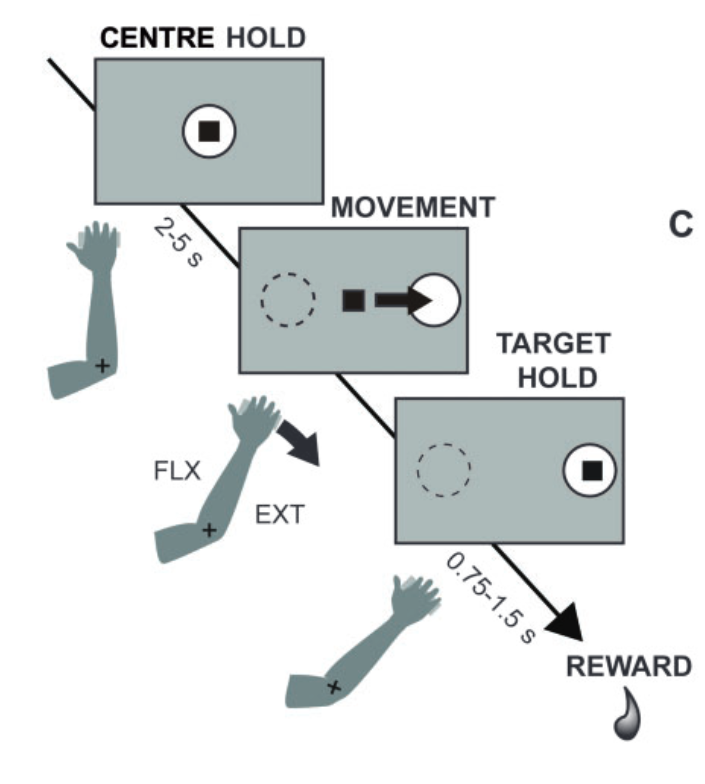

# Conversion Notes

## Scope of Work
[link](https://docs.google.com/document/d/1QiJqoLkSIVx7yHg-PSUnLraxlkd_eu4RJP-V5XMEvEw/edit?usp=sharing)

(this is private)

## Data File vs Metadata Integrity Issues

### File-CSV Correspondence Analysis

**Total Data Files:** 360 files in `/home/heberto/data/turner/Ven_All/`
- 359 unit data files (format: `vXXXX.N.mat`)
- 1 metadata file: `VenTable.mat` (excluded from conversion)

**CSV Metadata Entries:** 361 total entries in `ven_table.csv`

### Neuron Counts Reported in Papers

The published papers report the following neuron sample sizes (subset of the full dataset analyzed for each study):

| Study | Paper | PTNs | CSNs | Total |
|-------|-------|------|------|-------|
| Active Movement | Brain 2016 | 153 | 126 | 279 |
| Pyramidal Tract | Cerebral Cortex 2011 | 123 | 98 | 221 |
| Muscle Stretch | Frontiers 2013 | 115 | 90 | 205 |

Note: Neuron counts vary across papers because each study applied different inclusion criteria (e.g., minimum trials, task-related activity, quality thresholds).

### Data Streams to Convert

The conversion pipeline will handle the following data streams:

- **Extracellular electrophysiology**
    - Spike times
    - Waveforms
    - Antidromic stimulation traces

- **Behavioral task events**
    - Trial timing
    - Reach targets
    - Perturbations
    - Rewards

- **Analog kinematics**
    - Elbow joint angle

- **LFP signals**
    - Trial-based (when present)

- **EMG signals**
    - Trial-based (when present)


### Electrode Coordinate System

The Turner lab dataset uses **chamber-relative coordinates** rather than absolute stereotactic atlas coordinates.

**📖 Full documentation**: [Anatomical Coordinates](documentation/anatomical_coordinates.md)

**Quick reference:**
- **A_P**: Anterior-Posterior position relative to chamber center (mm, positive = anterior)
- **M_L**: Medial-Lateral position relative to chamber center (mm, positive = lateral)
- **Depth**: Electrode depth below chamber reference point (mm, positive = deeper)
- **Target region**: Primary motor cortex (M1), arm representation area, Layer 5

#### **Atlas Relationship**
These coordinates do NOT directly correspond to standard macaque brain atlas coordinates (Horsley-Clarke, MNI Macaque Atlas, AC/PC-based). They represent positions within a subject-specific coordinate frame defined by the implanted recording chamber. For cross-study analysis, coordinates would need individual transformation based on each animal's anatomy and chamber placement.

### Data Stream Locations in MATLAB Files

#### **Extracellular Electrophysiology**
- **Spike times**: `unit_ts` matrix - **Two data formats encountered:**
  - **Standard format**: Shape (n_trials, max_spikes_per_trial), padded with NaNs
  - **Compact format**: Shape (n_values,) - 1D array with one value per condition/trial
  - The conversion handles both formats automatically
- **Waveforms**: Not stored (online spike sorting performed during recording)
- **Antidromic stimulation traces**: 
  - `StrStim` - Striatum stimulation sweeps (50ms, 20kHz)
  - `PedStim` - Cerebral peduncle stimulation sweeps
  - `ThalStim` - Thalamus stimulation sweeps  
  - `STNStim` - Subthalamic nucleus stimulation sweeps

#### **Behavioral Task Events**
- **Trial timing**: `Events` structure
  - `Events.home_cue_on` - Start position target appearance
  - `Events.targ_cue_on` - Peripheral target appearance
  - `Events.home_leave` - Movement onset (cursor exit from start)
  - `Events.reward` - Reward delivery time
- **Reach targets**: `Events.targ_dir` (1=flexion, 2=extension)
- **Perturbations**: `Events.tq_flex`, `Events.tq_ext` (torque perturbation onsets, when present)

#### **Analog Kinematics**
- **Elbow joint angle**: `Analog.x[trial_idx]` (1kHz sampling for monkey Ven)
- **Angular velocity**: `Analog.vel[trial_idx]` (calculated from position)
- **Torque commands**: `Analog.torq[trial_idx]` (motor control signals)
- **Movement parameters**: `Mvt` structure with extracted measures
  - `Mvt.onset_t`, `Mvt.end_t`, `Mvt.pkvel`, `Mvt.mvt_amp`

#### **LFP Signals**
- **Location**: `Analog.lfp[trial_idx]` (when present)
- **Properties**: 1-100Hz bandpass, 10k gain, trial-based segments
- **Availability**: Check metadata `lfp_collected` flag

#### **EMG Signals**  
- **Location**: `Analog.emg[trial_idx]` (when present)
- **Properties**: 5-6 arm muscles, rectified & low-pass filtered
- **Shape**: (time_points, n_muscles)
- **Availability**: Check metadata `emg_collected` flag

#### **Cell Type Identification**
- **Source**: Metadata table `ven_table.csv`, column `Antidrom`
- **Classifications**:
  - `PED` = Pyramidal tract neurons (PTNs)
  - `STRI` = Corticostriatal neurons (CSNs)
  - `NR` = No response, `NT` = Not tested

#### **Receptive Field Testing**
- **Source**: Metadata table `ven_table.csv`, columns `SENSORY` and `SENS_DETAIL`
- **Purpose**: Qualitative characterization of each neuron's receptive field through manual sensorimotor examination
- **receptive_field_location**: Body region(s) comprising the receptive field (hand, wrist, elbow, forearm, shoulder, finger)
- **receptive_field_stimulus**: Stimulus type that activated the neuron (ext, flex, pron, sup, active, light touch)
- **Distribution**: 35% hand-related, 10% proximal arm, 14% multiple regions, 28% no response, 19% not tested
- **📖 Detailed documentation**: [Sensory Receptive Field Testing](documentation/sensory_receptive_field_testing.md)

**📖 Complete reading instructions**: [File Structure Documentation](assets/data_exploration/file_structure.md)

**📖 Additional documentation:**
- [Trial Structure](documentation/trial_structure.md) - Trial timing and boundary definitions
- [NWB Conversion Strategy](documentation/nwb_conversion.md) - Data stream mapping to NWB
- [Stimulation Events](documentation/stimulation_events.md) - In-trial stimulation handling
- [Electrodes in Experiment](documentation/electrodes_in_experiment.md) - Recording vs stimulation electrodes

### Data Format Variations

The conversion handles different data formats automatically. Technical details documented separately for data authors.


## Animal Subjects

The dataset includes recordings from two rhesus macaque monkeys, the same subjects used across all three published papers.

| Subject | ID | Species | Sex | Weight | Dataset Files |
|---------|-----|---------|-----|--------|---------------|
| Monkey V | Ven | *Macaca mulatta* | Female | 4.8 kg | v0502-v5604 |
| Monkey L | Lau | *Macaca mulatta* | Female | 6.0 kg | Included in dataset |

**Subject-specific EMG implants**:
- **Monkey L**: flexor carpi ulnaris, flexor carpi radialis, biceps longus, brachioradialis, triceps lateralis
- **Monkey V**: posterior deltoid, trapezius, triceps longus, triceps lateralis, brachioradialis

## Keywords
**MPTP**: 1-methyl-4-phenyl-1,2,3,6-tetrahydropyridine: A neurotoxin used to induce parkinsonism in primates by selectively destroying dopaminergic neurons in the substantia nigra.

**M1**: Primary Motor Cortex: The cortical area essential for generating voluntary movement, also a target of basal ganglia-thalamocortical projections.

**SNc**: Substantia Nigra pars compacta: Midbrain structure containing dopaminergic neurons; degenerates in Parkinson's disease (documented with TH immunostaining).

**BG**: Basal Ganglia: A group of subcortical nuclei involved in motor control and strongly implicated in Parkinson's disease pathophysiology.

**PTN**: Pyramidal Tract-type Neuron: Cortical neurons in layer 5b projecting to the spinal cord (via corticospinal tract). Strongly affected by MPTP; central to conveying motor commands.

**CSN**: Corticostriatal Neuron: Cortical intratelencephalic neurons projecting to the striatum; relatively spared in parkinsonism compared to PTNs.

**GLM**: Generalized Linear Model: Statistical model used to quantify spike-rate encoding of kinematic parameters (direction, position, speed, acceleration).

**SDF**: Spike Density Function: A continuous estimate of neuronal firing rate over time, built by convolving spike trains with a kernel.

**EMG**: Electromyography: Muscle electrical activity recordings, used to assess motor output during movements and reflexes.

**LLSR**: Long-Latency Stretch Reflex: A transcortical reflex response to muscle stretch, exaggerated in Parkinson's disease and thought to underlie rigidity.

**RT**: Reaction Time: Delay between stimulus and initiation of movement, often prolonged after MPTP.

**MD**: Movement Duration: Time taken to complete a movement, typically lengthened in parkinsonism.

**Velmax / Acc**: Peak Velocity / Acceleration: Kinematic parameters encoded by M1 neurons and affected by MPTP.

**TH**: Tyrosine Hydroxylase: Enzyme marker for dopaminergic neurons, used in histology to confirm MPTP-induced nigral cell loss.

## Paper notes and metadata

**📖 Comprehensive paper summaries**: [Paper Summaries and Notes](assets/papers_summary_and_notes/)
- [Active Movement Summary](assets/papers_summary_and_notes/active_movement_summary.md) - Pasquereau, DeLong & Turner (2016) Brain
- [Pyramidal Tract Neurons Summary](assets/papers_summary_and_notes/pyramidal_tract_neurons_summary.md) - Pasquereau & Turner (2011) Cerebral Cortex
- [Muscle Stretch Summary](assets/papers_summary_and_notes/muscle_stretch_summary.md) - Pasquereau & Turner (2013) Frontiers
- [Experimental Setup Commonalities](assets/papers_summary_and_notes/experimental_setup_commonalities.md) - Cross-study comparison

### Surgery

From the active movement paper  
> After training, each monkey was prepared for recording by aseptic surgery under isoflurane inhalation anaesthesia. A cylindrical stainless steel chamber was implanted with stereotaxic guidance over a burr hole allowing access to the arm-related regions of the left M1 and the putamen. The chamber was oriented parallel to the coronal plane at an angle of 35° so that electrode penetrations were orthogonal to the cortical surface. The chamber was fixed to the skull with bone screws and dental acrylic. Bolts were embedded in the acrylic to allow fixation of the head during recording sessions.

From the stretch paper:
> The animals were prepared surgically using aseptic techniques under Isoflurane inhalation anesthesia (Pasquereau and Turner, 2011). A cylindrical stainless steel chamber was implanted at an angle of 35◦ in the coronal plane to allow access to the arm-related regions of the left M1 and the posterior putamen. The chamber and hardware for head fixation were fixed to the skull with bone screws and methyl methacrylate polymer.

From the pyramidal tract neurons paper:
> After training, each monkey was prepared surgically for recording using aseptic surgery under Isoflurane inhalation anesthesia. A cylindrical stainless steel chamber was implanted with stereotaxic guidance over a burr hole allowing access to the arm-related regions of the left M1 and the posterior putamen. The chamber was oriented parallel to the coronal plane at an angle of 35° so that electrode penetrations were orthogonal to the cortical surface. The chamber was fixed to the skull with bone screws and dental acrylic. Bolts were embedded in the acrylic to allow fixation of the head during recording sessions. Prophylactic antibiotics and analgesics were administered postsurgically.'


### EMG
From the active movement paper

> For EMG recording, pairs of Teflon-insulated multistranded stainless steel wires were implanted into: flexor carpi ulnaris, flexor carpi radialis, biceps longus, brachioradialis and triceps lateralis in Monkey L; and posterior deltoid, trapezius, triceps longus, triceps lateralis and brachioradialis in Monkey V. The wires were led subcutaneously to a connector fixed to the skull implant.

Stretch paper

> Pairs of fine Teflon‑insulated multistranded stainless steel wires were implanted into multiple arm muscles: flexor carpi ulnaris, flexor carpi radialis, biceps longus, brachioradialis, and triceps lateralis in Monkey L; and posterior deltoid, trapezius, triceps longus, triceps lateralis, and brachioradialis in Monkey V. The wires were led subcutaneously to a connector fixed to the skull implant. Accurate placement of electromyographic (EMG) electrodes was verified post‑surgically, and following surgery the animals received prophylactic antibiotics and analgesic medication.

### Antidromic identification

> The method used to implant chronically-indwelling stimulation electrodes has been described previously (Turner and DeLong, 2000; Pasquereau and Turner, 2011). In brief, PTNs and CSNs were identified by antidromic activation from electrodes implanted in the cerebral peduncle and posteriolateral striatum, respectively. Sites for implantation were identified using standard electrophysiological mapping techniques. Three custom-built PtIr microwire electrodes were implanted in the posterior putamen and one electrode was implanted in the arm-responsive portion of the pre-pontine peduncle (for details, see Turner and DeLong, 2000). Histological reconstruction confirmed that the striatal and peduncle electrodes were at sites known to receive the bulk of M1 CSN and PTN projections, respectively (Brodal, 1978; Flaherty and Graybiel, 1991; Takada et al., 1998).

#### Explanation for me: What is Antidromic Identification?

**The Basic Concept:**

Antidromic identification is a neurophysiological technique used to determine where a neuron sends its axon (its projection target). The term "antidromic" means "backward-traveling" - instead of waiting for a signal to travel naturally from the cell body down the axon (orthodromic), you stimulate at the axon terminal and measure the signal traveling backward to the cell body.

**How It Works:**

1. **Recording**: Place a microelectrode in the cortex (M1) to record from a single neuron
2. **Stimulation**: Electrically stimulate at a known projection target (e.g., cerebral peduncle for spinal cord projections, or striatum for basal ganglia projections)
3. **Detection**: If the neuron projects to that target, the electrical stimulation will trigger an action potential that travels backward (antidromically) up the axon to the cell body
4. **Measurement**: This antidromic spike appears in your cortical recording with a short, fixed latency

**The Hypothesis Being Tested:**

The fundamental hypothesis is: **"Does this cortical neuron project to location X?"**

For this study:
- **Hypothesis 1**: If stimulating the cerebral peduncle causes an antidromic spike → the neuron is a Pyramidal Tract Neuron (PTN) projecting to spinal cord
- **Hypothesis 2**: If stimulating the striatum causes an antidromic spike → the neuron is a Corticostriatal Neuron (CSN) projecting to basal ganglia
- **Null result**: No antidromic response → neuron projects elsewhere or response too weak to detect

**Key Characteristics of Antidromic Spikes:**

- **Fixed latency**: Same delay every time (because it's a direct electrical connection)
- **Collision test**: An orthodromic spike will "collide with" and cancel an antidromic spike traveling in the opposite direction on the same axon
- **High-frequency following**: Can reliably respond to repeated stimulation (unlike synaptic transmission which fatigues)

**How This Study Used Antidromic Identification:**

1. **Chronic implantation**: Stimulation electrodes were permanently implanted in:
   - **Cerebral peduncle** (pre-pontine, arm-responsive region): Tests for PTNs
   - **Posterior putamen** (posterolateral striatum, 3 electrodes): Tests for CSNs
   - Additional sites: Thalamus and STN in some sessions

2. **Classification during recording**: While recording from M1 neurons during behavioral tasks, researchers periodically delivered electrical pulses to each stimulation site to identify:
   - **PED response** → Pyramidal tract neuron (projects to spinal cord via corticospinal tract)
   - **STRI response** → Corticostriatal neuron (projects to basal ganglia)
   - **NT (Not Tested)** → Antidromic testing not performed
   - **NR (No Response)** → No antidromic response detected at any site

3. **Data stored in this dataset**:
   - **Stimulation traces**: Raw voltage recordings during antidromic testing (StrStim, PedStim, ThalStim, STNStim arrays in MATLAB files)
   - **Classification metadata**: Cell type labels in `ven_table.csv` (Antidrom column: PED, STRI, NT, NR)
   - **Latency and threshold**: Response timing (ms) and minimum stimulation current (μA) needed to trigger antidromic spike

**Why This Matters for the Study:**

The central question of this research is whether MPTP-induced parkinsonism differentially affects neurons based on their **output targets**. Antidromic identification allowed researchers to compare:

- **PTNs** (spinal cord projections): Direct motor output neurons that command movement
- **CSNs** (basal ganglia projections): Neurons that feed into the motor planning circuit

The study found that PTNs were more severely affected by MPTP than CSNs, revealing that the motor cortex dysfunction in parkinsonism is projection-specific, not just a general cortical impairment.

**Location in Converted NWB Files:**

- Antidromic stimulation traces: `nwbfile.processing['antidromic_identification']`
- Cell type classification: `nwbfile.units['neuron_projection_type']` (pyramidal_tract_neuron, corticostriatal_neuron, not_tested, no_response)
- Response properties: `nwbfile.units['antidromic_latency_ms']`, `nwbfile.units['antidromic_threshold']`
- MPTP treatment status: `nwbfile.units['is_post_mptp']` (boolean: True=parkinsonian, False=baseline)

### NWB Surgery and Pharmacology Metadata

The converted NWB files include detailed surgical and pharmacological metadata extracted from the published papers. This information is stored in structured NWB fields to document the experimental procedures.

**Surgery Information** (`nwbfile.surgery`):
- Chamber implantation procedure under Isoflurane anesthesia
- Cylindrical stainless steel recording chamber positioned over left M1 and posterior putamen
- Chamber orientation: 35° to coronal plane for orthogonal cortical penetration
- Implanted stimulating electrodes for antidromic identification:
  - 3 custom floating electrodes (Teflon-coated PtIr microwires, 50-μm diameter) in posterior putamen
  - 1 electrode in prepontine cerebral peduncle
- Prophylactic antibiotics and analgesics administered perioperatively

**Pharmacology Information** (`nwbfile.pharmacology`):
- MPTP (1-methyl-4-phenyl-1,2,3,6-tetrahydropyridine) administration details:
  - Dose: 0.5 mg/kg
  - Route: Unilateral left internal carotid artery under general anesthesia
  - Timeline: Post-MPTP recordings obtained >30 days following administration (range: 36-117 days)
  - Histological verification: 67% loss of tyrosine hydroxylase-positive neurons in substantia nigra pars compacta (MPTP-treated hemisphere)
- Session-specific MPTP status appended to pharmacology field:
  - Pre-MPTP sessions: "This recording was obtained BEFORE MPTP administration (baseline control condition)"
  - Post-MPTP sessions: "This recording was obtained AFTER MPTP administration (parkinsonian condition)"

**MPTP Condition Tracking**:
MPTP treatment status is documented in multiple locations for comprehensive tracking:
- `nwbfile.session_id`: Includes PreMPTP or PostMPTP designation (e.g., "V0502++PreMPTP++Depth22130um++19990406")
- `nwbfile.session_description`: Includes MPTP condition summary
- `nwbfile.pharmacology`: Contains detailed protocol and session-specific status

## Trial Structure and Session Organization

### Dataset Organization Analysis

Based on metadata analysis of the Turner Lab dataset:

**Recording Session Structure**:
- **359 MATLAB files** across **85 unique recording dates**
- **Multiple sessions per day**: 1-11 recording sessions on the same date
- **Each session contains 2-40 trials** (mean: ~14 trials per session)

**Evidence from metadata table (`ven_table.csv`)**:
```python
# Analysis shows:
unique_dates = df['DateCollected'].nunique()  # 85 dates
total_files = len(df)  # 359 files
trials_per_session = df['ntrials1_1'].mean()  # ~14 trials average
```

**Same-day recordings represent different sessions because**:
- Different electrode depths and spatial coordinates (A-P, M-L)
- Different units isolated (UnitNum1, UnitNum2)
- Independent trial sequences with complete data streams
- Distinct cell type identification results per session

### Session-Level Organization

Each MATLAB file represents a distinct recording session with:
- **Spatial specificity**: Unique electrode placement (depth, A-P, M-L coordinates)
- **Neural specificity**: 1-2 isolated single units with antidromic identification
- **Temporal specificity**: Complete trial sequence with behavioral and neural data
- **Experimental context**: Pre/Post MPTP condition, recording date, sensory responses

### Same-Day Recording Strategy

Example from metadata analysis:
```
21-Jan-2000 (11 sessions):
- v4507-v4513: Sequential electrode advancement
- Depth progression: 18.45mm → 20.00mm
- Systematic cell type identification across cortical layers
```

This approach enabled systematic exploration of cortical space and identification of different neuron types within single experimental days.

### Special Case: "b" Suffix Files

Four sessions have variant recordings denoted by a "b" suffix (v3607b, v4527b, v4810b, v5604b):

| Session Pair | Base Session | "b" Variant | Relationship |
|--------------|--------------|-------------|--------------|
| v3607/v3607b | PED, 20 trials | STRI, 20 trials | Same date, different neurons, different cell types |
| v4527/v4527b | PED+NT, 47 trials (2 units) | PED, 27 trials | Same date, different neuron, fewer trials |
| v4810/v4810b | PED, 80 trials | NR, 40 trials | Same date, different neuron, fewer trials |
| v5604/v5604b | PED, 80 trials | STRI, 40 trials | Same date, different neurons, fewer trials |

**Key characteristics of "b" files:**
- Recorded on the same date as their base counterpart
- Contain data from different isolated neurons
- May have different trial counts (often fewer trials)
- Represent distinct recording sessions despite same-day collection
- Often have different cell type classifications (e.g., PED vs STRI)

### NWB Conversion Implications

**Conclusion**: **One MATLAB file → One NWB session**

This session-based approach:
1. Preserves scientific integrity of individual recording sessions
2. Maintains spatial and temporal relationships within each session
3. Enables both single-session analysis and cross-session comparisons
4. Properly represents the experimental methodology
5. Treats "b" suffix files as independent sessions with unique session IDs

**Conversion Statistics:**
- **299 unique sessions** converted from 359 MATLAB unit files
- **100% conversion rate** (all sessions successfully converted)
- Session ID format preserves original filename including "b" suffix when present

**Detailed NWB conversion strategy**: [NWB Conversion Documentation](assets/data_exploration/nwb_conversion.md)

## Trial Structure Within Recording Sessions

### Trial description in the papers
The description of the trial in the paper is the following:

**active movement paper**
> A trial began when a centre target appeared on the monitor and the monkey aligned the cursor with the target. After holding the cursor at this start-position hold period (2–5 s, uniform random distribution), the target jumped to the left or right (chosen at random), and the animal moved the cursor to capture the lateral target. After a target-hold interval (0.75–1.5 s), the animal received a drop of juice or food, followed by an intertrial interval (1.2–1.7 s).

**stretch paper**
The description in another paper:
> A trial began when a center target appeared and the monkey made the appropriate joint movement to align the cursor with the target. The monkey maintained this position for the duration of a start-position hold period (random duration, 2–5 s), during which the animal could not predict the location of the upcoming lateral target. The target then shifted to the left or right (chosen at random), and the animal moved the cursor to capture the lateral target. The animal received a drop of juice for successful completion of the task.

> On two‑thirds of the trials (selected at random), single flexing or extending torque impulses (0.1 Nm–50 ms duration) were applied to the manipulandum by a DC brushless torque motor (TQ40W, Aerotech Inc., Pittsburgh PA) at an unpredictable time beginning 1–2 s (uniform randomized distribution) after initial capture of the center target. Each square‑wave torque impulse induced an angular displacement of the joint (mean = 10‑deg) causing a sudden stretch of arm extensor or flexor muscles. The animals were not trained to produce a specific response to these unpredictable perturbations, but the animals naturally adopted a strategy that returned the joint to its initial pre‑impulse position.

**Pyramidal tract neurons paper**
> On each behavioral trial, the animal was required to align the cursor with a series of targets displayed on the monitor. A trial began when a center target appeared and the monkey made the appropriate joint movement to align the cursor with the target. The monkey maintained this position for the duration of a start-position hold period (random duration, 2–5 s), during which the animal could not predict the location of the upcoming lateral target. The target then shifted to the left or right (chosen at random), and the animal moved the cursor to capture the lateral target. The animal received a drop of juice or food for successful completion of the task.


### Visual Overview


**Figure Analysis**: This experimental protocol diagram shows the visuomotor step-tracking task structure. The monkey begins by maintaining cursor position at a center hold target (top panel). After a variable hold period (~2.5s), a peripheral target appears requiring either flexion (FLX) or extension (EXT) elbow movement. The monkey must move the cursor from center to the target (movement phase), then maintain position at the target (target hold, 0.75-1.5s) to receive liquid reward. The paradigm tests elbow joint motor control through a simple center-out reaching task with two possible directions corresponding to anatomical flexion/extension movements.


### Trial Temporal Structure

Based on analysis of 359 MATLAB files containing 9,949 trials, the experimental protocol follows this chronological sequence:

```
Trial Timeline (mean timings from 9,949 trials):

Trial Start (0ms)
    │
    ├── Center Target Appearance (2,453ms ± 756ms)
    │   • Visual cue for monkey to align cursor with center position
    │   • Range: 1.3-11.4s, establishes baseline elbow position
    │   
    ├── [Hold Period: ~4.1s average]
    │   • Monkey maintains cursor at center target
    │   • Torque perturbations applied here when present (1-2s after capture)
    │     └── Torque Impulse: 0.1 Nm, 50ms, causing ~10° displacement
    │
    ├── Lateral Target Appearance (6,563ms ± 1,288ms)
    │   • Peripheral target signals movement direction (flexion/extension)  
    │   • Range: 4.0-20.6s, determines required motor response
    │
    ├── [Reaction Time: ~430ms average]
    │   • Motor planning and decision period
    │
    ├── Subject Movement Onset (6,993ms ± 1,291ms)
    │   • Monkey begins movement from center toward lateral target
    │   • Range: 4.3-21.4s, volitional movement initiation
    │   │
    │   ├── Derived Movement Onset (6,898ms ± 1,273ms)
    │   │   • Algorithmically detected movement start from kinematics
    │   │
    │   ├── Peak Velocity Time (7,089ms ± 1,272ms) 
    │   │   • Maximum velocity: 101.9±37.5°/s (range: 20.2-254.8°/s)
    │   │
    │   └── Derived Movement End (7,286ms ± 1,276ms)
    │       • Movement amplitude: -3.4±19.7° (range: -37.9° to 30.4°)
    │       • End position: -1.3±19.5° (range: -28.8° to 30.1°)
    │
    ├── Reward Delivery (7,950ms ± 1,319ms)
    │   • Liquid reward for successful target acquisition
    │   • Range: 5.3-22.3s, ~957ms after movement onset
    │
    └── Recording End (8,748ms ± 1,382ms)
        • Analog data capture continues ~799ms beyond reward
        • Total duration: 1.5-23.1s per trial (mean: 8.7s)
        • 1kHz sampling for position, velocity, torque, EMG, LFP
        • Spike times recorded throughout with millisecond precision
```

**Key Temporal Features:**
- Variable trial durations accommodate different behavioral states in parkinsonian monkeys
- Extended hold periods ensure stable starting positions for movement analysis  
- Post-reward data collection captures movement completion and return-to-baseline
- High temporal resolution (1ms) enables precise neural-behavioral correlations


## Scientific Papers and Experimental Protocols

The Turner Lab ASAP M1 MPTP dataset supports **three complementary research studies** that examined different aspects of motor cortex dysfunction in MPTP-induced parkinsonism using the same fundamental experimental setup.

### Paper 1: Active Movement Encoding

**Research Hypothesis**: MPTP-induced parkinsonism alters M1 encoding of voluntary movement kinematics through three potential mechanisms: hypoactivation (reduced excitatory drive), loss of functional specificity (degraded selectivity), or abnormal timing (altered temporal dynamics). The study specifically tested whether pyramidal tract neurons (PTNs) and corticostriatal neurons (CSNs) show differential vulnerabilities in movement parameter encoding.

**Data Captured**: Single-unit recordings during visuomotor step-tracking task with focus on movement-related neural activity, kinematic parameter encoding (position, velocity, acceleration, direction), and cell-type specific responses during active reaching movements.

### Paper 2: Muscle Stretch Responses  

**Research Hypothesis**: MPTP-induced parkinsonism alters cortical processing of proprioceptive information through enhanced cortical excitability, degraded spatial selectivity, or temporal dysregulation of stretch reflex pathways. The study examined whether the long-latency stretch reflex (LLSR) mediated through M1 shows abnormal enhancement in parkinsonism.

**Data Captured**: Neural responses to unexpected torque perturbations during the reaching task, with focus on stretch-evoked activity, response latencies, directional selectivity during passive limb manipulation, and proprioceptive feedback processing.

### Paper 3: Pyramidal Tract Neuron Spontaneous Activity

**Research Hypothesis**: MPTP-induced parkinsonism affects resting-state cortical activity in a cell-type specific manner, with pyramidal tract neurons showing differential vulnerability compared to corticostriatal neurons during non-movement periods.

**Data Captured**: Spontaneous firing rates during rest periods, baseline neural activity during inter-trial intervals and center hold phases, with emphasis on cell-type identification and comparison of resting-state activity patterns.

## Data Stream Utilization Across Studies

| Data Stream | Description | Paper 1: Active Movement | Paper 2: Muscle Stretch | Paper 3: Spontaneous Activity |
|-------------|-------------|---------------------------|--------------------------|-------------------------------|
| **Spike Times (`unit_ts`)** | Single-unit action potentials, trial-based timing | Used: Movement-related firing patterns | Used: Stretch-evoked neural responses | Used: Baseline activity during rest |
| **Trial Events (`Events.home_cue_on`)** | Start position target appearance | Used: Trial structure timing | Not used | Not used |
| **Trial Events (`Events.targ_cue_on`)** | Peripheral target appearance | Used: Movement cue timing | Not used | Not used |
| **Trial Events (`Events.targ_dir`)** | Target direction (1=flex, 2=ext) | Used: Direction-specific encoding | Not used | Not used |
| **Trial Events (`Events.home_leave`)** | Movement onset timing | Used: Movement initiation analysis | Not used | Not used |
| **Trial Events (`Events.reward`)** | Reward delivery timing | Used: Task completion timing | Not used | Not used |
| **Perturbation Events (`Events.tq_flex`)** | Flexion torque perturbation onset | Not used | Used: Stretch reflex timing | Not used |
| **Perturbation Events (`Events.tq_ext`)** | Extension torque perturbation onset | Not used | Used: Stretch reflex timing | Not used |
| **Joint Position (`Analog.x`)** | Elbow/wrist angle during movement | Used: Kinematic parameter encoding | Used: Joint position during stretch | Not used |
| **Joint Velocity (`Analog.vel`)** | Angular velocity of movement | Used: Velocity encoding analysis | Used: Velocity during perturbations | Not used |
| **Torque Commands (`Analog.torq`)** | Motor control signals | Used: Movement control analysis | Used: Perturbation force delivery | Not used |
| **EMG Signals (`Analog.emg`)** | Muscle electrical activity | Not used | Used: Stretch reflex responses | Not used |
| **LFP Signals (`Analog.lfp`)** | Local field potential | Not used | Not used | Not used |
| **Movement Parameters (`Mvt.onset_t`, `Mvt.pkvel`, etc.)** | Extracted movement kinematics | Used: Movement parameter decoding | Not used | Not used |
| **Antidromic Stimulation (`StrStim`, `PedStim`)** | Cell type identification traces | Used: PTN vs CSN classification | Used: PTN vs CSN classification | Used: PTN vs CSN classification |
| **Cell Type Metadata (`Antidrom` column)** | PTN/CSN classification results | Used: Cell-type specific analysis | Used: Cell-type specific analysis | Used: Cell-type specific analysis |
| **Spatial Coordinates (`A_P`, `M_L`, `Depth`)** | Electrode recording location | Not used | Not used | Not used |
| **MPTP Condition (`MPTP` column)** | Pre/Post treatment classification | Used: Condition comparison | Used: Condition comparison | Used: Condition comparison |

## Unified Experimental Protocol

All studies used the same **visuomotor step-tracking paradigm**:

```
                    EXPERIMENTAL PROTOCOL
                   Turner Lab MPTP Studies

┌─────────────────────────────────────────────────────────────────┐
│                      TRIAL STRUCTURE                            │
│                                                                 │
│  ┌─────────┐    ┌────────────┐    ┌─────────────┐    ┌───────┐  │
│  │ CENTER  │────│   TARGET   │────│  MOVEMENT   │────│REWARD │  │
│  │  HOLD   │    │PRESENTATION│    │ EXECUTION   │    │       │  │
│  │         │    │            │    │             │    │       │  │
│  │Variable │    │Left/Right  │    │Flexion/     │    │Liquid │  │
│  │duration │    │peripheral  │    │Extension    │    │reward │  │
│  │         │    │target      │    │reaching     │    │       │  │
│  └─────────┘    └────────────┘    └─────────────┘    └───────┘  │
│                                                                 │
│             PERTURBATIONS (random subset of trials)            │
│             ┌─────────────────────────────────────┐            │
│             │ Unexpected torque pulses            │            │
│             │ • Flexion (tq_flex) or Extension   │            │
│             │ • Applied during movement phase     │            │
│             │ • Elicit stretch reflex responses   │            │
│             └─────────────────────────────────────┘            │
└─────────────────────────────────────────────────────────────────┘
```
## DATA ANALYSIS FOCUS BY STUDY

| Paper 1: Movement Phase | Paper 2: Perturbation Trials | Paper 3: Hold/Rest Periods |
|---|---|---|
| Target → Movement phase | tq_flex/tq_ext responses | Center hold baseline |
| Kinematic encoding | Stretch-evoked activity | Inter-trial intervals |
| Direction-specific activity | LLSR timing analysis | Spontaneous firing |
| Movement parameter decoding | Proprioceptive processing | Cell-type comparisons |

## Data Organization for Multi-Study Support

**Single experimental paradigm, multiple analytical perspectives**:

- **Events structure**: Supports timing analysis for all three studies
- **Spike data**: Same neural recordings provide movement encoding, stretch responses, and spontaneous activity
- **Analog signals**: Joint kinematics support both voluntary movement and perturbation analyses
- **Perturbation identification**: Trials with torque perturbations identified by non-NaN values in `tq_flex`/`tq_ext`
- **Cell type metadata**: Antidromic identification enables cell-type specific analyses across all studies