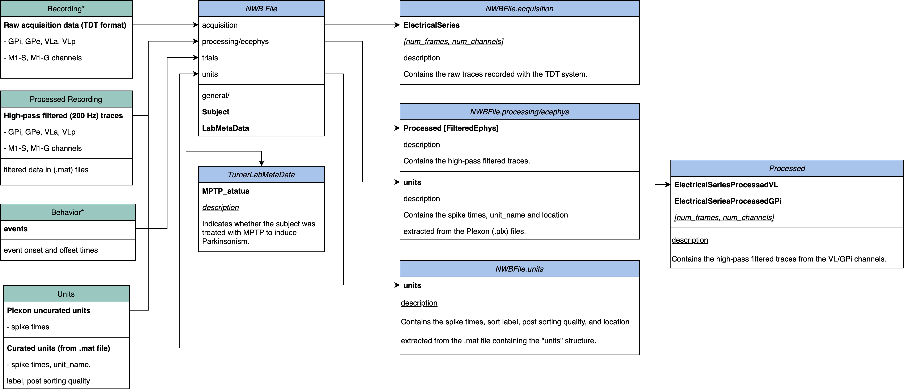

# Notes concerning the asap_tdt conversion

## Experiment notes

Based on the [manuscript](https://journals.plos.org/plosbiology/article?id=10.1371/journal.pbio.3000829) provided by the lab, the experiment was performed as follows:

Extracellular spiking activity of neurons in globus pallidus-internus (GPi) and ventrolateral anterior nucleus (VLa) was recorded using multiple glass-insulated tungsten microelectrodes (0.5–1.5 MΩ, Alpha Omega)
or 16-contact linear probes (0.5–1.0 MΩ, V-probe, Plexon) in monkeys while performing a choice reaction time reaching task.
During a subset of data collection sessions, EMG activity was collected via either chronically implanted subcutaneous electrodes or electrodes inserted percutaneously immediately before the session.
All recordings were performed with at least one electrode positioned in each of GPi and VLa.
The stored neuronal data were high-pass filtered (200 Hz) and thresholded, and candidate action potentials were sorted into clusters in principal components space (Off-line Sorter, Plexon).

## DataList spreadsheet

The DataList spreadsheet contains information about the electrodes (e.g. the electrode number, the brain region, the depth, etc.)
and the sessions (the date, the task, whether stimulation was applied etc.).

## TDT session folder structure

Each TDT folder contains multiple sessions (e.g. `I_160615_1` and `I_160615_2`).
The continuous data for each session is stored in Tucker Davis format (with files of `.Tbk`, `.Tdx`, `.tev`, `.tnt`, `.tsq`). The raw data and the high-pass filtered data
is stored in `.ddt` and `.flt.mat` files. The `.plx` files contain the spike sorting data from Plexon Offline Sorter v3.

Depending on the subject, the files structure is different.

### "Isis" folder structure

For subject "Isis" the files are organized in the following way:

    {root_folder}/                               # The root folder containing the sessions e.g. "pre_MPTP"
    └── Isis/                                    # The folder containing the sessions for a given subject e.g. "Isis"
        ├── {date_string}/                       # The folder containing the sessions for a given date e.g. "160615"
        │   ├── Gaia_{session_id}.Tbk            # Raw acquisition data in Tucker Davis (TDT) format
        │   ├── ... (other TDT files)
        │   ├── {session_id}.mat                 # Events data in Matlab format (also contains units and optionally stimulation data)
        │   ├── {session_id}_Chans_1_1.ddt       # Raw data from channel 1 in DDT format
        │   ├── {session_id}_Chans_1_1.flt.mat   # High-pass filtered data from channel 1 in Matlab format
        │   ├── {session_id}_Chans_1_1.mat       # Raw data from channel 1 in Matlab format
        │   ├── {session_id}_Chans_1_1.plx       # Plexon file for channel 1
        │   ├── {session_id}_Chans_17_32.ddt     # Raw data from channel 17 to 32 in DDT format
        │   ├── {session_id}_Chans_17_32.flt.mat # High-pass filtered data from channel 17 to 32 in Matlab format
        │   ├── {session_id}_Chans_17_32.mat     # Raw data from channel 17 to 32 in Matlab format
        │   └── {session_id}_Chans_17_32.plx     # Spike sorting data from channel 17 to 32

### "Gaia" folder structure

For subject "Gaia" the files are organized in the following way:

    {root_folder}/                     # The root folder containing the sessions e.g. "pre_MPTP"
    └── Gaia/                          # The folder containing the sessions for a given subject e.g. "Gaia"
        ├── {date_string}/             # The folder containing the sessions for a given date e.g. "160615"
        │   ├── Gaia_{session_id}.Tbk  # Raw acquisition data in Tucker Davis (TDT) format
        │   ├── ... (other TDT files)
        │   ├── {session_id}.mat       # Events data in Matlab format (also contains units and optionally stimulation data)
        │   ├── {session_id}.flt.mat   # High-pass filtered data in Matlab format (all channels)
        │   ├── {session_id}.plx       # Plexon file (all channels)


## TDT data

The TDT files contain the following streams of data:
- the extracellular signal is stored in the `"Conx"` stream
- the EMG data is stored in the `"EMGx"` stream. (if not empty)
- the stimulation data is stored in the `"DBSx"` stream. (if not empty)
- the event data is stored in the `"Task"` stream.

Note that the stimulation and event data are also stored in `.mat` files.

## Events data

The events data is stored in `.mat` files (in a structure called `events`).

| Event Name   | Description   |
|--------------|---------------|
| trialnum     | The identifier of the trial |
| starttime    | The start time of the trial (sec) |
| endtime      | The end time of the trial (sec) |
| erroron      | The time of the error onset |
| target       | The identifier of the target (1:left or 3:right in this task) |
| rewardon     | The time of the reward onset |
| rewardoff    | The time of the reward off |
| mvt_onset    | The time of the hand sensor at the home-position off (= onset of the movement) |
| mvt_end      | The time of the hand sensor at the reach target on (= end of the movement) |
| return_onset | The time of the hand sensor at the reach target off (= onset of the return movement) |
| return_end   | The time of the hand sensor at the home-position on (= end of the return movement) |
| cue_onset    | The time of the target and go-cue instruction (reach target and go-cue were instructed simultaneously in this task) |

## Subject metadata

The subject metadata can be provided in the respective conversion folders e.g. `src/turner_lab_to_nwb/asap_tdt/metadata/subjects_metadata.yaml` file as the follows:

```yaml
Subject:
  {subject_id}:
    species: Macaca mulatta # The formal latin binomal name for the species of the subject
    subject_id: {subject_id} # The unique identifier of the subject
    date_of_birth: 2009-01-01
    sex: F # F, M or U for unknown
```

## Run conversion for a single session

`asap_tdt_convert_session.py`: this script defines the function to convert one full session of the conversion.

Required Parameters:

- "`nwbfile_path`" : The path to the NWB file to be created.
- "`tdt_tank_file_path`" : The path to a TDT Tank file (.Tbk).
- "`session_metadata`" : The `pandas.DataFrame` object that contains the metadata for the session.
- "`session_id`" : The identifier of the session.
- "`subject_id`" : The identifier of the subject.
- "`events_file_path`" : The path that to the .mat file containing the events, units data and optionally include the stimulation data.

Optional Parameters:

- "`flt_file_path`" :  The path to the high-pass filtered data (.mat).
- "`plexon_file_path`" : The path to the Plexon file (.plx).
- "`target_name_mapping`" : A dictionary mapping the task target identifiers to more descriptive names, e.g. 1: "Left", 3: "Right".

### Example usage

To run a specific conversion, you might need to install first some conversion specific dependencies that are located in each conversion directory:
```
cd src/turner_lab_to_nwb/asap_tdt
pip install -r asap_tdt_requirements.txt
```
Then you can run a specific conversion with the following command:
```
python asap_tdt_gaia/asap_tdt_convert_session.py
```

## Run conversion for all TDT sessions with public or embargo dataset mode

`asap_tdt_convert_all_sessions.py`: this script defines the function to convert all sessions of the conversion.

Required Parameters:
- "`folder_path`" : The root path to the TDT sessions.
- "`output_folder_path"`: The folder where the NWB files will be stored.
- "`data_list_file_path`" : The path to the electrode metadata file (.xlsx).
- "`gpi_only`": Whether to convert only the GPI sessions, default is False.

### GPi only mode

When the `gpi_only` parameter is set to `True`, the conversion script will only convert the sessions that contain GPi data.
The general metadata for the pre-MPTP sessions can be edited by modifying the yaml file at `src/turner_lab_to_nwb/asap_tdt/metadata/pre_MPTP_GPi_only_metadata.yaml`.
The general metadata for the post-MPTP sessions can be edited by modifying the yaml file at `src/turner_lab_to_nwb/asap_tdt/metadata/post_MPTP_GPi_only_metadata.yaml`.

When the `gpi_only` parameter is set to `False`, the conversion script will convert all (GPi and non-GPi) data.
The general metadata for the pre-MPTP sessions can be edited by modifying the yaml file at `src/turner_lab_to_nwb/asap_tdt/metadata/pre_MPTP_metadata.yaml`.
The general metadata for the post-MPTP sessions can be edited by modifying the yaml file at `src/turner_lab_to_nwb/asap_tdt/metadata/post_MPTP_metadata.yaml`.

## TDT to NWB mapping

The following table describes the mapping between the source data and the NWB data:


